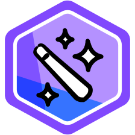

# Every day assignments

---

## 2024-11-11

🎒 Today’s Assignments

1. Complete the Intro Unit – “Foundational Large Language Models & Text Generation”, which is:

    - [Optional] Listen to the summary [podcast episode](https://youtu.be/mQDlCZZsOyo) for this unit (created by [NotebookLM](https://notebooklm.google.com/?original_referer=https:%2F%2Fwww.google.com%23&pli=1)).
    - Read the [“Foundational Large Language Models & Text Generation” whitepaper](https://www.kaggle.com/whitepaper-foundational-llm-and-text-generation). Introduction:

        The advent of Large Language Models (LLMs) represents a seismic shift in the world of artificial intelligence. Their ability to process, generate, and understand user intent is fundamentally changing the way we interact with information and technology.
        An LLM is an advanced artificial intelligence system that specializes in processing, understanding, and generating human-like text. These systems are typically implemented as a deep neural network and are trained on massive amounts of text data. This allows them to learn the intricate patterns of language, giving them the ability to perform a variety of tasks, like machine translation, creative text generation, question answering, text summarization, and many more reasoning and language oriented tasks. This whitepaper dives into the timeline of the various architectures and approaches building up to the large language models and the architectures being used at the time of publication. It also discusses fine- tuning techniques to customize an LLM to a certain domain or task, methods to make the training more efficient, as well as methods to accelerate inference. These are then followed by various applications and code examples.

2. Complete Unit 1 – “Prompt Engineering”, which is:

    - [Optional] Listen to the summary [podcast episode](https://youtu.be/F_hJ2Ey4BNc) for this unit (created by NotebookLM).
    - Read the [“Prompt Engineering” whitepaper](https://www.kaggle.com/whitepaper-prompt-engineering). Introducton:

        When thinking about a large language model input and output, a text prompt (sometimes accompanied by other modalities such as image prompts) is the input the model uses to predict a specific output. You don’t need to be a data scientist or a machine learning engineer – everyone can write a prompt. However, crafting the most effective prompt can be complicated. Many aspects of your prompt affect its efficacy: the model you use, the model’s training data, the model configurations, your word-choice, style and tone, structure, and context all matter. Therefore, prompt engineering is an iterative process. Inadequate prompts can lead to ambiguous, inaccurate responses, and can hinder the model’s ability to provide meaningful output. You don’t need to be a data scientist or a machine learning engineer – everyone can write a prompt.
        When you chat with the Gemini chatbot, you basically write prompts, however this whitepaper focuses on writing prompts for the Gemini model within Vertex AI or by using the API, because by prompting the model directly you will have access to the configuration such as temperature etc.
        This whitepaper discusses prompt engineering in detail. We will look into the various prompting techniques to help you getting started and share tips and best practices to become a prompting expert. We will also discuss some of the challenges you can face while crafting prompts.

    - Complete [this code lab](https://www.kaggle.com/code/markishere/day-1-prompting) on Kaggle where you’ll learn prompting fundamentals. Make sure you phone verify your account before starting, it's necessary for the code labs.

💡What You’ll Learn

Today you’ll explore the evolution of LLMs, from transformers to techniques like fine-tuning and inference acceleration. You’ll also get trained in the art of prompt engineering for optimal LLM interaction.

The code lab will walk you through getting started with the Gemini API and cover several prompt techniques and how different parameters impact the prompts.

📋 Reminders

- Tomorrow at 11:00 am ET / 4:00 pm GMT,  Paige Bailey is hosting the first livestream on our YouTube channel to discuss the assignments with the course authors and other special guests from Google. Tomorrow’s guests are Mohammadamin Barekatain, Lee Boonstra, Logan Kilpatrick, Daniel Mankowitz, Majd Merey Al, Anant Nawalgaria, Aliaksei Severyn and Chuck Sugnet. It’ll be recorded in case you’re unable to attend.
- Discord is the best place to ask questions – specifically in the #5dgai-q-and-a channel. In addition to other participants, several Googlers are there to help. During the livestream, we'll also pick several questions from Discord to discuss. You'll get Kaggle swag if your question is chosen!
- We created a new channel in Discord called #5dgai-announcements that will be used exclusively for course announcements from us.
- We want this course community to be positive and supportive. Please follow Kaggle’s community guidelines found [here](https://www.kaggle.com/community-guidelines).

Happy learning and see you tomorrow!

### First Livestream

Today’s livestream starts at 11:00 am ET / 4:00 pm GMT. [Click here to join](https://www.youtube.com/watch?v=dnGuDNhD3Ag&list=PLqFaTIg4myu-b1PlxitQdY0UYIbys-2es&index=1)!

Paige Bailey will be discussing the assignments with the course authors and other special guests from Google. Today’s guests are Mohammadamin Barekatain, Lee Boonstra, Logan Kilpatrick, Daniel Mankowitz, Majd Merey Al, Anant Nawalgaria, Aliaksei Severyn and Chuck Sugnet. It will be recorded in case you’re unable to attend.

To simplify timezone complexities, we made a single playlist of all scheduled livestreams this week with clear start times [here](https://www.youtube.com/playlist?list=PLqFaTIg4myu-b1PlxitQdY0UYIbys-2es).

## 2024-11-12

🎒 Today’s Assignments

- Complete Unit 2: “Embeddings and Vector Stores/Databases”, which is:
  - [Optional] Listen to the [summary podcast](https://youtube.com/watch?v=1CC39K76Nqs) episode for this unit (created by [NotebookLM](https://notebooklm.google.com/?original_referer=https:%2F%2Fwww.google.com%23&pli=1)).
  - Read the [“Embeddings and Vector Stores/Databases” whitepaper](https://kaggle.com/whitepaper-embeddings-and-vector-stores). Introduction:

    Modern machine learning thrives on diverse data—images, text, audio, and more. This whitepaper explores the power of embeddings, which transform this heterogeneous data into a unified vector representation for seamless use in various applications. We'll guide you through:

    - Understanding Embeddings: Why they are essential for handling multimodal data and their diverse applications.
    - Embedding Techniques: Methods for mapping different data types into a common vector space.
    - Efficient Management: Techniques for storing, retrieving, and searching vast collections of embeddings.
    - Vector Databases: Specialized systems for managing and querying embeddings, including practical considerations for production deployment.
    - Real-World Applications: Concrete examples of how embeddings and vector databases are combined with large language models (LLMs) to solve real-world problems.

    Throughout the whitepaper, code snippets provide hands-on illustrations of key concepts.

  - Complete these code labs on Kaggle:
    - [Build](https://www.kaggle.com/code/markishere/day-2-document-q-a-with-rag) a RAG question-answering system over custom documents
    - [Explore](https://www.kaggle.com/code/markishere/day-2-embeddings-and-similarity-scores) text similarity with embeddings
    - [Build](https://www.kaggle.com/code/markishere/day-2-classifying-embeddings-with-keras) a neural classification network with Keras using embeddings

💡 What You’ll Learn

Today you will learn about the conceptual underpinning of embeddings and vector databases and how they can be used to bring live or specialist data into your LLM application. You’ll also explore their geometrical powers for classifying and comparing textual data.

📋 Reminders and Announcements

- Here is the [recording from this morning’s livestream](https://www.youtube.com/watch?v=kpRyiJUUFxY). Fortunately our recording did not have any of the technical glitches as today's livestream.
- The 2nd livestream is tomorrow with Paige Bailey and special guests: Omid Fatemieh, Jinhyuk Lee, Alan Li, Iftekhar Naim, Anant Nawalgaria, Yan Qiao, and Xiaoqi Ren.
- Unfortunately, to ensure a fix to our livestream issues moving forward, we need to push back our broadcast time. We'll send another email with updated livestream info soon.
- Be sure to ask all your questions about the podcast, readings, and code lab in the [#5dgai-q-and-a](https://discord.gg/gNrC9Xut) channel on Discord. You'll get Kaggle swag if your question is chosen for discussion during the livestream!

Happy learning and see you tomorrow.

### Second Livestream

Today’s livestream starts at 2PM PST/ 5PM EST/ 10:00 PM UTC. [Click here to join](https://youtube.com/watch?v=86GZC56rQCc&list=PLqFaTIg4myu-b1PlxitQdY0UYIbys-2es&index=3)!

Paige Bailey will be joined by Omid Fatemieh, Jinhyuk Lee, Alan Li, Iftekhar Naim, Anant Nawalgaria, Yan Qiao, and Xiaoqi Ren to discuss embeddings and vector stores/databases. It will be recorded in case you’re unable to attend.

For the complete list of scheduled livestreams and past recordings, check out this [YouTube playlist](https://www.youtube.com/playlist?list=PLqFaTIg4myu-b1PlxitQdY0UYIbys-2es).

See you soon.

## 2024-11-13

🎒 Today’s Assignments

- Complete Unit 3: “Generative AI Agents”, which is:
  - [Optional] Listen to the summary [podcast episode](https://youtu.be/H4gZd4BCrDQ) for this unit (created by [NotebookLM](https://notebooklm.google/)).
  - Read the [“Generative AI Agents” whitepaper](https://www.kaggle.com/whitepaper-agents).

    Humans are fantastic at messy pattern recognition tasks. However, they often rely on tools - like books, Google Search, or a calculator - to supplement their prior knowledge before arriving at a conclusion. Just like humans, Generative AI models can be trained to use tools to access real-time information or suggest a real-world action. For example, a model can leverage a database retrieval tool to access specific information, like a customer's purchase history, so it can generate tailored shopping recommendations. Alternatively, based on a user's query, a model can make various API calls to send an email response to a colleague or complete a financial transaction on your behalf. To do so, the model must not only have access to a set of external tools, it needs the ability to plan and execute any task in a self- directed fashion. This combination of reasoning, logic, and access to external information that are all connected to a Generative AI model invokes the concept of an agent, or a program that extends beyond the standalone capabilities of a Generative AI model. This whitepaper dives into all these and associated aspects in more detail.

  - Complete these code labs on Kaggle:
    - [Talk](https://www.kaggle.com/code/markishere/day-3-function-calling-with-the-gemini-api) to a database with function calling
    - [Build](https://www.kaggle.com/code/markishere/day-3-building-an-agent-with-langgraph/) an agentic ordering system in LangGraph

💡 What You’ll Learn

Learn to build sophisticated AI agents by understanding their core components and the iterative development process.

The code labs cover how to connect LLMs to existing systems and to the real world. Learn about function calling by giving SQL tools to a chatbot, and learn how to build a LangGraph agent that takes orders in a café.

📋 Reminders and Announcements

- Here is the [recording from Day 2’s livestream](https://www.youtube.com/live/86GZC56rQCc?si=trAoT7PVtYC5LQ7B).
- The next livestream is tomorrow at 2pm PST/ 5pm EST/ 10pm UTC. [Click here to join](https://www.youtube.com/watch?v=HQUtMWoTAD4&list=PLqFaTIg4myu-b1PlxitQdY0UYIbys-2es&index=3)! Livestream guests: Alan Blount, Wes Dyer, Steven Johnson, Patrick Marlow, Anant Nawalgaria, and Julia Wiesinger.
- Find a [complete list of scheduled livestreams and past recordings here](https://www.youtube.com/playlist?list=PLqFaTIg4myu-b1PlxitQdY0UYIbys-2es).
- Be sure to ask all your questions about the podcast, readings, and code lab on [Discord](https://discord.gg/gNrC9Xut).
- Additionally, we’ve added 2 new channels on Discord to enhance discussion:
  - [#5dgai-question-forum](https://discord.gg/kaggle) is a Discord forum (a special type of channel) where you can create specific threads, which will help finding answers easier in the future.
  - [#5dgai-course-content](https://discord.gg/kaggle) is a Discord channel for deeper discussion of course content only (excluding technical troubleshooting questions).

Happy learning and see you tomorrow.

### Third Livestream

Today’s livestream starts at 2PM PST/ 5PM EST/ 10:00 PM UTC. [Click here to join](https://www.youtube.com/live/HQUtMWoTAD4?si=4wCmQXmNStFjjvrg)!

Paige Bailey will be joined by specialists to discuss Generative AI Agents. It will be recorded in case you’re unable to attend.

For the complete list of scheduled livestreams and past recordings, check out this [YouTube playlist](https://www.youtube.com/playlist?list=PLqFaTIg4myu-b1PlxitQdY0UYIbys-2es).

See you soon.

### Kaggle Badge Claim

At the end of the week, you're eligible to earn a Kaggle Badge on your [Kaggle Profile](https://www.kaggle.com/me) for participating in this course! The badge is a fantastic way to stand out and demonstrate your growing expertise in generative AI.

How to claim your badge:

Complete all codelabs for this course.
At the end of the week we will automatically award the badge to anyone who has done this on Kaggle. We will automatically check for anyone who has pressed “Copy & Edit” on the codelabs, there is no need to ‘submit’ anything or to save your work.
If you had any trouble using Kaggle to complete the codelabs or don’t see the badge on your profile by Monday, Nov 18th you can [fill out this form](https://docs.google.com/forms/d/e/1FAIpQLSdbC-GufVwFC5leQ72_N_dnq_hKrCUHRqHM1JMnf2XPrls9hw/viewform?resourcekey=0-HWiBm8ULYS9iFDZ6Ir0ZGQ) and we will make sure you receive it. We ask for your Kaggle username and links or descriptions of your completed code lab assignments.
Deadline for submission of the form is Friday, Nov 22 (one week after the event).

Because the course is primarily self-paced and includes a lot of reading, podcast, and livestream episodes, we can't certify completion of every assignment and need to rely heavily on code lab participation. That said, we hope you take full advantage of all the learning resources – they'll boost your educational experience significantly.

If there are any issues with your badge redemption, please contact <jennilynf@xwf.kaggle.com>.

Happy learning!

## 2024-11-14

🎒 Today’s Assignment

Complete Unit 4: “Domain-Specific LLMs”, which is:

- [Optional] Listen to the summary [podcast episode](https://youtu.be/b1a4ZOQ8XdI) for this unit (created by NotebookLM).
- Read the [“Solving Domain-Specific Problems Using LLMs” whitepaper](https://www.kaggle.com/whitepaper-solving-domains-specific-problems-using-llms).

  Large language models (LLMs) have emerged as powerful tools for tackling complex challenges in numerous domains. While early iterations focused on general-purpose tasks, recent developments have highlighted the potential of fine-tuning LLMs to address specific problems within specialized fields. This whitepaper explores these concepts in two distinct domains: cybersecurity and medicine. Each showcases the unique ability of LLMs to enhance existing workflows and unlock new possibilities.
  Cybersecurity presents a number of unique challenges for LLMs, including a scarcity of publicly available data, a wide diversity of highly technical concepts, and information about threats that change on a daily basis. Additionally, sensitive use cases, like malware analysis, necessitate specific considerations for model development. We address these challenges by focusing on cybersecurity-specific content and tasks, pairing security-focused language models with a suite of supporting techniques to offer improved performance for vital tasks like threat identification and risk analysis.
  In the field of medicine, LLMs face a different set of obstacles, such as the vast and ever- evolving nature of medical knowledge and the need to apply said knowledge in a context- dependent manner that makes accurate diagnosis and treatment a continual challenge.
  LLMs like Med-PaLM, customized for medical applications, demonstrate the ability to answer complex medical questions and provide insightful interpretations of medical data, showing potential for supporting both clinicians and patients. Through the lens of these two distinct domains, in this whitepaper we will explore the challenges and opportunities presented by specialized data, technical language, and sensitive use cases. By examining the unique paths taken by SecLM and Med-PaLM, we provide insights into the potential of LLMs to revolutionize various areas of expertise.

- Complete these code labs on Kaggle:
  - [Use](https://www.kaggle.com/code/markishere/day-4-google-search-grounding) Google Search data in generation
  - [Tune](https://www.kaggle.com/code/markishere/day-4-fine-tuning-a-custom-model) a Gemini model for a custom task

💡 What You’ll Learn

In today’s reading, you’ll delve into the creation and application of specialized LLMs like SecLM and MedLM/Med-PaLM, with insights from the researchers who built them.

In the code labs you will learn how to add real world data to a model beyond its knowledge cut-off by grounding with Google Search.  You will also learn how to fine-tune a custom Gemini model using your own labeled data to solve custom tasks.

📋 Reminders and Announcements

- Here is the [recording from Day 3’s livestream](https://www.youtube.com/watch?v=HQUtMWoTAD4&list=PLqFaTIg4myu-b1PlxitQdY0UYIbys-2es&index=4).
- The next livestream with Paige Bailey is tomorrow at 2pm PST/ 5pm EST/ 10pm UTC. [Click here to join](https://www.youtube.com/watch?v=odvuLMJWUSU&list=PLqFaTIg4myu-b1PlxitQdY0UYIbys-2es&index=4)! Livestream guests: Scott Coull, Antonio Gulli, Anant Nawalgaria, Christopher Semturs, and Umesh Shankar.
- Find a [complete list of scheduled livestreams and past recordings here](https://www.youtube.com/playlist?list=PLqFaTIg4myu-b1PlxitQdY0UYIbys-2es).
- Be sure to ask all your questions about the podcast, readings, and code lab on [Discord](https://discord.gg/gNrC9Xut).

Happy learning and see you tomorrow.

### Forth Livestream

Today’s livestream starts at 2PM PST/ 5PM EST/ 10:00 PM UTC. [Click here to join](https://www.youtube.com/watch?v=odvuLMJWUSU&list=PLqFaTIg4myu-b1PlxitQdY0UYIbys-2es&index=4)!

Paige Bailey will be joined by Scott Coull, Antonio Gulli, Anant Nawalgaria, Christopher Semturs, and Umesh Shankar to discuss domain specific models. It will be recorded in case you’re unable to attend.

For the complete list of scheduled livestreams and past recordings, check out this [YouTube playlist](https://www.youtube.com/playlist?list=PLqFaTIg4myu-b1PlxitQdY0UYIbys-2es).

See you soon.

## 2024-11-15

🎒 Final Assignment

Complete Unit 5: “MLOps for Generative AI”, which is:

- [Optional] Listen to the summary [podcast episode](https://youtu.be/k9S6IhiUUj4) for this unit (created by [NotebookLM](https://notebooklm.google/)).
- Read the [“MLOps for Generative AI” whitepaper](https://www.kaggle.com/whitepaper-operationalizing-generative-ai-on-vertex-ai-using-mlops).

  The emergence of foundation models and generative AI (gen AI) has introduced a new era for building AI systems. Selecting the right model from a diverse range of architectures and sizes, curating data, engineering optimal prompts, tuning models for specific tasks, grounding model outputs in real-world data, optimizing hardware - these are just a few of the novel challenges that large models introduce.
  This whitepaper delves into the fundamental tenets of MLOps and the necessary adaptations required for the domain of gen AI and Foundation Models. We also examine the diverse range of Vertex AI products, specifically tailored to address the unique demands of foundation models and gen AI-based applications. Through this exploration we uncover how Vertex AI, with its solid foundations of AI infrastructure and MLOps tools, expands its capabilities to provide a comprehensive MLOps platform for gen AI.
  
- No code lab for today! We will do a code walkthrough and live demo of [goo.gle/e2e-gen-ai-app-starter-pack](https://goo.gle/e2e-gen-ai-app-starter-pack), a resource created for making MLOps for Gen AI easier and accelerating the path to production. Please go through the repository in advance.

💡 What You’ll Learn

Discover how to adapt MLOps practices for Generative AI and leverage Vertex AI's tools for foundation models and generative AI applications.

📋 Reminders and Announcements

- Here is the [recording from Day 4’s livestream](https://www.youtube.com/watch?v=odvuLMJWUSU&list=PLqFaTIg4myu-b1PlxitQdY0UYIbys-2es&index=4).
- 5th and final livestream is tomorrow at 2pm PST/ 5pm EST/ 10pm UTC hosted by Paige Bailey with special guests: Advait Bopardikar, Sokratis Kartakis, Gabriela Hernandez Larios, Veer Muchandi, Anant Nawalgaria, Elia Secchi, and  Olivia Wiles.
- Find a [complete list of scheduled livestreams and past recordings here](https://www.youtube.com/playlist?list=PLqFaTIg4myu-b1PlxitQdY0UYIbys-2es).
- Be sure to ask all your questions in [Discord](https://discord.gg/gNrC9Xut). You'll get Kaggle swag if your question is chosen for discussion during the livestream!

Happy learning and see you tomorrow.

### Fifth Livestream

## Finishing the Intensive Course

Congrats on finishing the 5-day Generative AI Intensive course! As we wrap things up, this is our final round up of reminders and announcements.

### 📋 Reminders and Announcements

📚 **Check out this bonus assignment**: There’s more! This [bonus notebook](https://www.kaggle.com/code/markishere/bonus-day-extra-api-features-to-try/) walks you through a few more things you can do with the Gemini API that weren't covered during the course. This material doesn't pair with the whitepapers or podcast, but covers some extra capabilities you might find useful when building Gemini API powered apps.

⭐ **Confirm your Kaggle badge**:  You're eligible to earn a badge on your [Kaggle Profile](https://www.kaggle.com/me) for participating in this course! If you pressed “Copy & Edit” on all assigned codelabs, we will automatically award the badge on your profile. If you have any trouble using Kaggle to complete the codelabs or don’t see the badge on your profile by Monday, Nov 18th, you can fill out this form and we will make sure you receive it. Deadline for submission of the form is Friday, Nov 22 (one week from today).

👀 **Look out for the Kaggle Learn Guide**: All of the course content will be aggregated and made publicly available next week as a handy Kaggle Learn Guide. We’ll share it with you as soon as it's ready. In the meantime, [all of the livestream recordings can be found here](https://www.youtube.com/playlist?list=PLqFaTIg4myu-b1PlxitQdY0UYIbys-2es).

🎟️ **Save the date for Cloud Next**: Google Cloud is offering this community a special discount to attend Next ’25, April 9–11, in Las Vegas, for $799 USD. Let Google know you’re interested here and they’ll send you a discount code as soon as registration opens.

📢 **Share your feedback**: Please [fill out this quick feedback form](https://docs.google.com/forms/d/e/1FAIpQLSfWPBqK10bVS81p6_BTVwlgMRCcXQcxbJUgrXa_btKBxq4pHw/viewform?usp=preview) to let us know more about your experience. It’ll help us improve the program for future participants. Your feedback is completely anonymous and should only take a few minutes.

And with that, thank you very much for joining us this week. We enjoyed connecting with you all and wish you nothing but the best as you continue to grow as an AI engineer.

Cheers,
